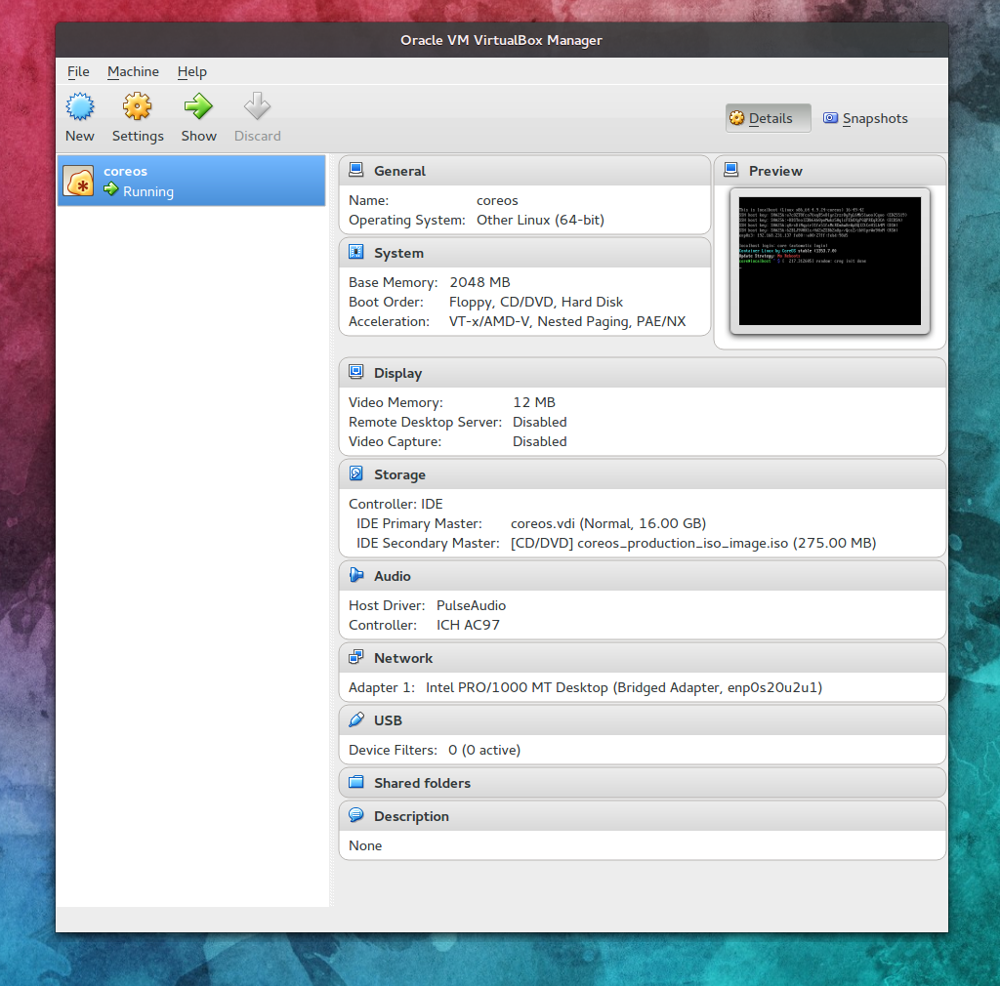
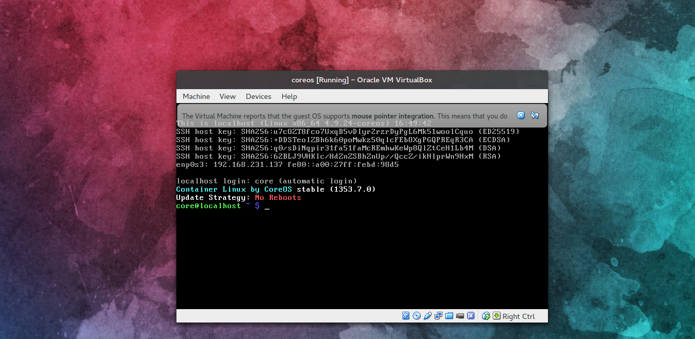

# Installazione della VM

## Requisiti

Prima di procedere con l'installazione del sistema operativo
è necessario garantire il provisioning di una macchina virtuale. Lo strumento di virtualizzazione è trasparente. 
È consigliata la scelta di uno strumento il più possibile familiare.

Per esempio: è possibile utilizzare lo strumento di virtualizzazione VirtualBox. 

Per l'installazione di VirtualBox seguire qualsiasi guida della più recente release del prodotto software. 

È consigliabile che come host fisico si utilizzi un sistema 
operativo Linux derivato. La possibilità Windows è possibile, ma porterà delle provvisorie complicanze dovute alla distanza 
del paradigma di utilizzo al confronto con il paradigma di Linux: essere developer friendly.  

## Assunzioni 

È dato per assunto che la macchina virtuale sia correttamente istanziata e configurata opportunamente.

Per esempio come segue:

 
Figura 1. Proprietà di esempio di una macchina virtuale creata ad hoc e come esempio. 

## Bootstrap di CoreOS

Dopo aver caricato l'immagine di CoreOS v1353.7.0 come immagine ISO nel lettore DVD dellla macchina virtuale, procedere con il boot del sistema operativo. 

Al boot il sistema eseguirà il logging automatico. 

Se vedete la seguente immagine allora il sistema operativo è
avviato correttamente:

 
Figura 2. Visualizzazione della schermata post login nel 
sistema. Lo stato del boot è buono.  

Al momento è possibile proseguire. Se non si è in grado di visualizzare un testo simile a quello in figura 2 ripetere la procedura di creazione.   